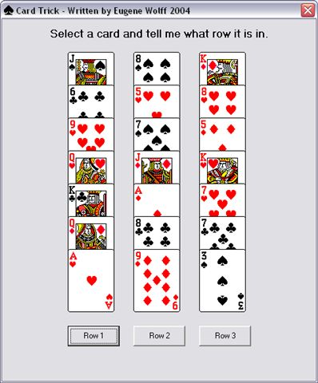

<div align="center">

## Card Trick


</div>

### Description

To demonstrate the use of the cards.dll shipped with windows. Only tested on Windows XP.
 
### More Info
 


<span>             |<span>
---                |---
**Submitted On**   |2004-09-09 07:23:06
**By**             |[Eugene Wolff](https://github.com/Planet-Source-Code/PSCIndex/blob/master/ByAuthor/eugene-wolff.md)
**Level**          |Intermediate
**User Rating**    |4.3 (30 globes from 7 users)
**Compatibility**  |VB 6\.0
**Category**       |[Complete Applications](https://github.com/Planet-Source-Code/PSCIndex/blob/master/ByCategory/complete-applications__1-27.md)
**World**          |[Visual Basic](https://github.com/Planet-Source-Code/PSCIndex/blob/master/ByWorld/visual-basic.md)
**Archive File**   |[Card\_Trick179104992004\.zip](https://github.com/Planet-Source-Code/eugene-wolff-card-trick__1-56073/archive/master.zip)

### API Declarations

```
Public Declare Function cdtInit Lib "cards.dll" (ByRef width As Long, ByRef height As Long) As Long
Public Declare Function cdtDraw Lib "cards.dll" (ByVal hdc As Long, ByVal x As Long, ByVal y As Long, ByVal card As Long, ByVal cardtype As Long, ByVal color As Long) As Long
```


